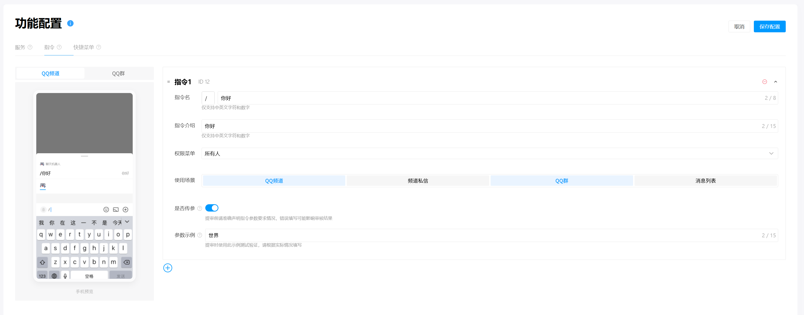

# FastQQBot
## 简介
* 基于 QQ 官方机器人 Python SDK 封装，快速实现 QQ 群聊和 QQ 频道的机器人搭建

## 快速开始
1. 克隆源码

    ```bash
    $ git clone https://github.com/jm12138/FastQQBot
    ```

2. 安装依赖

    ```bash
    $ cd FastQQBot
    $ pip install .
    ```

3. QQ 开放平台配置

    1. 登录 [QQ 开放平台](https://q.qq.com)

    2. 应用管理 -> 创建机器人或选择已创建的机器人

    3. 开发 -> 开发管理 -> 开发设置

    4. 复制 AppID 并生成 AppSecret

    5. 开发 -> 功能配置 -> 指令

    6. 参考下图并根据需要配置指令 -> 保存配置

        


4. 新建 .env 文件并按 [.env.example](./.env.example) 进行配置

    ```
    APP_ID=''
    APP_SECRET=''
    ```

5. 参考 [main.py](./main.py) 编写机器人回复代码

    ```python
    from os import getenv
    from typing import Union

    from dotenv import load_dotenv
    from fastqqbot import Client

    from botpy import Intents
    from botpy.ext.command_util import Commands
    from botpy.message import Message, GroupMessage


    class BotClient(Client):
        # 配置指令回复
        @Commands("你好")
        async def hello(self, message: Union[Message, GroupMessage], params: str):
            # params: 指令传入的参数文本

            # 根据指令及传入的参数文本回复信息
            await self.post_message(message=message, content=f"你好! {params}")

        async def on_create(self, message: Union[Message, GroupMessage]):
            # 注册函数
            await self.hello(message=message)


    if __name__ == "__main__":
        # 加载本地环境变量
        load_dotenv()

        # 获取 AppID / AppSecret
        appid = getenv("APP_ID")
        secret = getenv("APP_SECRET")

        # 启动 QQ 机器人客户端
        intents = Intents.default()
        client = BotClient(intents=intents)
        client.run(appid=appid, secret=secret)
    ```